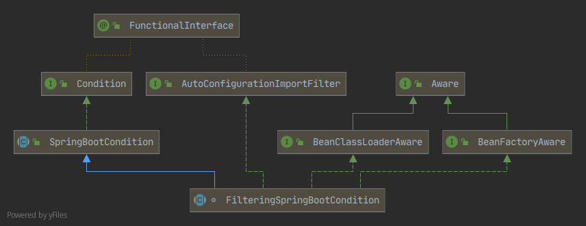

# Spring Boot 条件注解原理

应用参考：condition-demo 模块。

条件注解功能：只有在所有指定条件都匹配时，组件才有资格注册。

可以用在@Configuration配置类上，@Bean方法上，＠Component等Bean类上。

## 条件注解原理

先手动实现一个简单的 Condition 类，如 SimpleLinuxCondition。条件注解加在了@Bean方法上，在matches() 中加断点，调试执行。

执行堆栈：

```java
matches:12, SimpleLinuxCondition (top.kwseeker.conditionaldemo.custom)
//是否满足条件
shouldSkip:108, ConditionEvaluator (org.springframework.context.annotation)
//是否被条件注解注释
loadBeanDefinitionsForBeanMethod:181, ConfigurationClassBeanDefinitionReader (org.springframework.context.annotation)
//加载@Bean方法
loadBeanDefinitionsForConfigurationClass:141, ConfigurationClassBeanDefinitionReader (org.springframework.context.annotation)
loadBeanDefinitions:117, ConfigurationClassBeanDefinitionReader (org.springframework.context.annotation)
processConfigBeanDefinitions:327, ConfigurationClassPostProcessor (org.springframework.context.annotation)
postProcessBeanDefinitionRegistry:232, ConfigurationClassPostProcessor (org.springframework.context.annotation)
//加载配置类
invokeBeanDefinitionRegistryPostProcessors:275, PostProcessorRegistrationDelegate (org.springframework.context.support)
invokeBeanFactoryPostProcessors:95, PostProcessorRegistrationDelegate (org.springframework.context.support)
invokeBeanFactoryPostProcessors:705, AbstractApplicationContext (org.springframework.context.support)
refresh:531, AbstractApplicationContext (org.springframework.context.support)
refresh:742, SpringApplication (org.springframework.boot)
refreshContext:389, SpringApplication (org.springframework.boot)
run:311, SpringApplication (org.springframework.boot)
run:1213, SpringApplication (org.springframework.boot)
run:1202, SpringApplication (org.springframework.boot)
main:10, ConditionalDemoApplication (top.kwseeker.conditionaldemo)
```

从 ConfigurationClassBeanDefinitionReader line181 开始看，可以看到从@Bean方法加载BeanDefinition时，经历了下面步骤：

1. 获取方法元数据（包括条件注解@Conditional内容）；

2. 执行ConditionEvaluator shouldSkip() 评估是否应该跳过加载这个Bean。

   ```java
   public boolean shouldSkip(@Nullable AnnotatedTypeMetadata metadata, @Nullable ConfigurationPhase phase) {
       //是否有注解@Conditional
       if (metadata != null && metadata.isAnnotated(Conditional.class.getName())) {
           if (phase == null) {
               return metadata instanceof AnnotationMetadata && ConfigurationClassUtils.isConfigurationCandidate((AnnotationMetadata)metadata) ? this.shouldSkip(metadata, ConfigurationPhase.PARSE_CONFIGURATION) : this.shouldSkip(metadata, ConfigurationPhase.REGISTER_BEAN);
           } else {
               List<Condition> conditions = new ArrayList();
               //获取所有条件注解类和注解属性
               Iterator var4 = this.getConditionClasses(metadata).iterator();
   			//遍历所有条件注解
               while(var4.hasNext()) {
                   String[] conditionClasses = (String[])var4.next();
                   String[] var6 = conditionClasses;
                   int var7 = conditionClasses.length;
   				//提取条件注解中条件类，存到conditions
                   for(int var8 = 0; var8 < var7; ++var8) {
                       String conditionClass = var6[var8];
                       Condition condition = this.getCondition(conditionClass, this.context.getClassLoader());
                       conditions.add(condition);
                   }
               }
   			//根据Order对Condition类进行排序，排序@Order注解，具体实现看AnnotationAwareOrderComparator
               AnnotationAwareOrderComparator.sort(conditions);
               var4 = conditions.iterator();
   			
               Condition condition;
               ConfigurationPhase requiredPhase;
               //排好序后一个执行条件匹配，有一个条件不匹配就返回true, 即跳过加载
               do {
                   do {
                       if (!var4.hasNext()) {
                           return false;
                       }
   
                       condition = (Condition)var4.next();
                       requiredPhase = null;
                       //条件为 ConfigurationCondition 有特殊处理？
                       if (condition instanceof ConfigurationCondition) {
                           requiredPhase = ((ConfigurationCondition)condition).getConfigurationPhase();
                       }
                   } while(requiredPhase != null && requiredPhase != phase);
                   //执行条件的 matches()。
               } while(condition.matches(this.context, metadata));
   
               return true;
           }
       } else {	//没有注解@Conditional,返回false, 即不跳过加载
           return false;
       }
   }
   ```

3. 执行Condition实现类 matches() 进行条件匹配。

   ```java
   @Override
   public boolean matches(ConditionContext conditionContext, AnnotatedTypeMetadata annotatedTypeMetadata) {
       Environment environment = conditionContext.getEnvironment();
       // 判断是否是Linux系统, 启动参数添加-Dos.name=linux
       String property = environment.getProperty("os.name");
       if (property == null) {
           return false;
       }
       return property.contains("Linux");
   }
   ```

   这里看看ConditionContext 和 AnnotatedTypeMetadata 中都有什么。

   ```java
   conditionContext = {ConditionEvaluator$ConditionContextImpl@3084} 
    registry = {DefaultListableBeanFactory@3092} "org.springframework.beans.factory.support.DefaultListableBeanFactory@5d12a356: defining beans [org.springframework.context.annotation.internalConfigurationAnnotationProcessor,org.springframework.context.annotation.internalAutowiredAnnotationProcessor,org.springframework.context.annotation.internalCommonAnnotationProcessor,org.springframework.context.event.internalEventListenerProcessor,org.springframework.context.event.internalEventListenerFactory,conditionalDemoApplication,org.springframework.boot.autoconfigure.internalCachingMetadataReaderFactory,devLogConfig,globalConfig,logService,propCondService,devLog,devEnv]; root of factory hierarchy"
    beanFactory = {DefaultListableBeanFactory@3092} "org.springframework.beans.factory.support.DefaultListableBeanFactory@5d12a356: defining beans [org.springframework.context.annotation.internalConfigurationAnnotationProcessor,org.springframework.context.annotation.internalAutowiredAnnotationProcessor,org.springframework.context.annotation.internalCommonAnnotationProcessor,org.springframework.context.event.internalEventListenerProcessor,org.springframework.context.event.internalEventListenerFactory,conditionalDemoApplication,org.springframework.boot.autoconfigure.internalCachingMetadataReaderFactory,devLogConfig,globalConfig,logService,propCondService,devLog,devEnv]; root of factory hierarchy"
    environment = {StandardEnvironment@3093} "StandardEnvironment {activeProfiles=[dev], defaultProfiles=[default], propertySources=[ConfigurationPropertySourcesPropertySource {name='configurationProperties'}, PropertiesPropertySource {name='systemProperties'}, OriginAwareSystemEnvironmentPropertySource {name='systemEnvironment'}, RandomValuePropertySource {name='random'}, OriginTrackedMapPropertySource {name='applicationConfig: [classpath:/application.yml]'}]}"
    resourceLoader = {AnnotationConfigApplicationContext@3094} "org.springframework.context.annotation.AnnotationConfigApplicationContext@2d9caaeb, started on Sun Sep 12 17:52:10 CST 2021"
    classLoader = {Launcher$AppClassLoader@2864} 
   annotatedTypeMetadata = {MethodMetadataReadingVisitor@3085} 
    methodName = "linuxProperty"
    access = 1
    declaringClassName = "top.kwseeker.conditionaldemo.config.GlobalConfig"
    returnTypeName = "top.kwseeker.conditionaldemo.bean.LinuxProperty"
    classLoader = {Launcher$AppClassLoader@2864} 
    methodMetadataSet = {LinkedHashSet@3089}  size = 2
    metaAnnotationMap = {LinkedHashMap@3090}  size = 0
    attributesMap = {LinkedMultiValueMap@3091}  size = 2
    api = 458752
    mv = null
   ```

4. 注册BeanDefinition。


## Q&A

+ 做测试的时候发现配置类上加某个普通Bean作为条件时，配置类无法成功加载？

  ```java
  //@ConditionalOnBean(name = "devEnv")   	//不起效
  //@ConditionalOnBean(DevEnv.class)      	//不起效
  @ConditionalOnBean(GlobalConfig.class)  	//这种正常
  public class DevLogConfig {
      ...
  }
  ```

  首先先看下 @ConditionalOnBean 的条件类 OnBeanCondition 条件匹配规则。

  OnBeanCondition extends FilteringSpringBootCondition

  

  1. 是否有注解 @ConditionalOnBean @ConditionalOnSingleCandidate @ConditionalOnMissingBean（OnBeanCondition 支持这三种注解的处理）。

     > @ConditionalOnSingleCandidate表示当指定Bean在容器中只有一个或者虽然有多个但是指定首选Bean才加载被注解的Bean。

  2. 以@ConditionalOnBean为例：

     ```java
     @Override
     public ConditionOutcome getMatchOutcome(ConditionContext context, AnnotatedTypeMetadata metadata) {
         ConditionMessage matchMessage = ConditionMessage.empty();
         if (metadata.isAnnotated(ConditionalOnBean.class.getName())) {
             //建立Bean搜索规则
             BeanSearchSpec spec = new BeanSearchSpec(context, metadata, ConditionalOnBean.class);
             //（按照类型或名称）搜索匹配的Bean， TODO 细节？
             MatchResult matchResult = getMatchingBeans(context, spec);
             if (!matchResult.isAllMatched()) {
                 //没有匹配的Bean
                 String reason = createOnBeanNoMatchReason(matchResult);
                 return ConditionOutcome
                     .noMatch(ConditionMessage.forCondition(ConditionalOnBean.class, spec).because(reason));
             }
             matchMessage = matchMessage.andCondition(ConditionalOnBean.class, spec).found("bean", "beans")
                 .items(Style.QUOTE, matchResult.getNamesOfAllMatches());
         }
         if (metadata.isAnnotated(ConditionalOnSingleCandidate.class.getName())) {
             ...
         }
         if (metadata.isAnnotated(ConditionalOnMissingBean.class.getName())) {
             ...
         }
         //找到匹配的Bean,再检查条件是否匹配
         return ConditionOutcome.match(matchMessage);
     }
     ```

     OnBeanCondition 按类型搜索匹配的Bean并不是查的Bean实例，而是从BeanTypeRegistry中查找指定类型的BeanDefinition 是否存在。如下调试结果，可以查到GlobalConfig.class的Bean定义，却没有DevEnv.class的Bean定义。

     ```java
     this.beanTypes = {HashMap@3645}  size = 19
      "org.springframework.context.annotation.internalCommonAnnotationProcessor" -> {ResolvableType@3676} "org.springframework.context.annotation.CommonAnnotationBeanPostProcessor"
      "springBootLoggingSystem" -> {ResolvableType@3678} "org.springframework.boot.logging.logback.LogbackLoggingSystem"
      "org.springframework.boot.autoconfigure.internalCachingMetadataReaderFactory" -> {ResolvableType@3680} "org.springframework.core.type.classreading.CachingMetadataReaderFactory"
      "propCondService" -> {ResolvableType@3682} "top.kwseeker.conditionaldemo.service.PropCondService"
      "springApplicationArguments" -> {ResolvableType@3684} "org.springframework.boot.DefaultApplicationArguments"
      "org.springframework.context.event.internalEventListenerFactory" -> {ResolvableType@3686} "org.springframework.context.event.DefaultEventListenerFactory"
      "conditionalDemoApplication" -> {ResolvableType@3688} "top.kwseeker.conditionaldemo.ConditionalDemoApplication"
      "autoConfigurationReport" -> {ResolvableType@3690} "org.springframework.boot.autoconfigure.condition.ConditionEvaluationReport"
      "logService" -> {ResolvableType@3692} "top.kwseeker.conditionaldemo.service.LogService"
      "org.springframework.boot.autoconfigure.condition.BeanTypeRegistry" -> {ResolvableType@3693} "org.springframework.boot.autoconfigure.condition.BeanTypeRegistry"
      "org.springframework.context.annotation.internalAutowiredAnnotationProcessor" -> {ResolvableType@3695} "org.springframework.beans.factory.annotation.AutowiredAnnotationBeanPostProcessor"
      "systemProperties" -> {ResolvableType@3697} "java.util.Properties"
      "springBootBanner" -> {ResolvableType@3699} "org.springframework.boot.SpringApplicationBannerPrinter$PrintedBanner"
      "environment" -> {ResolvableType@3701} "org.springframework.core.env.StandardEnvironment"
      "globalConfig" -> {ResolvableType@3703} "top.kwseeker.conditionaldemo.config.GlobalConfig"
      "systemEnvironment" -> {ResolvableType@3705} "java.util.Collections$UnmodifiableMap<?, ?>"
      "org.springframework.context.event.internalEventListenerProcessor" -> {ResolvableType@3707} "org.springframework.context.event.EventListenerMethodProcessor"
      "org.springframework.boot.context.ContextIdApplicationContextInitializer$ContextId" -> {ResolvableType@3709} "org.springframework.boot.context.ContextIdApplicationContextInitializer$ContextId"
      "org.springframework.context.annotation.internalConfigurationAnnotationProcessor" -> {ResolvableType@3711} "org.springframework.context.annotation.ConfigurationClassPostProcessor"
     ```

     估计是因为devEnv是在GlobalConfig中加载BeanDefinition的，而DevLogConfig和GlobalConfig是平级加载的，@Bean方法相对配置类BeanDefinition加载有滞后 （*TODO：check，根据Spring Boot 启动详细流程看看是不是这样*）。

  总结：不能拿一个@Configuration配置Bean中@Bean方法注册的Bean名字或类型作为另一个@Configuration配置Bean加载的条件。