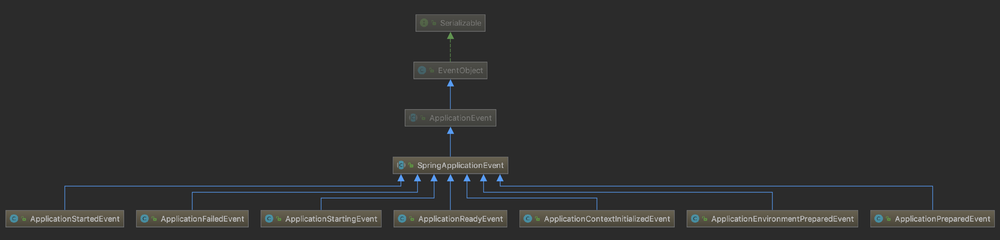

# Spring 事件&监听

属于事件监听模式，可视为观察者模式的拓展。

Spring Boot 事件是 Spring 事件的拓展。

## 观察者模式

与其说观察者模式感觉更适合叫做"状态处理模型"。
包含被观察者（状态标志和关注这个状态的观察者列表）和观察者（包含状态改变后的处理逻辑）。
被观察者做了包括状态改变的判断，以及获取观察者列表调用观察者处理方法的一切事情；
而观察者只是被动地执行一下处理逻辑。

实现查看 spring-event observer。

## 事件监听器模式

与观察者模式本质流程差不多。
只是观察者变成了监听器，被观察者变成了事件，另外把原本状态改变判断的逻辑抽离成了事件源。
事件内定义了事件源。

事件源添加监听器；
事件源发布事件,获取监听器列表，依次执行回调处理事件；

## Spring 事件

Spring 事件 ApplicationEvent 由 ApplicationEventPublisher 接口发布。
ApplicationContext 实现类一般也实现了 ApplicationEventPublisher接口。
而发布事件的方法则获取 ApplicationEventMulticaster 接口实例，并调用
multicastEvent()方法发布事件。
```
getApplicationEventMulticaster().multicastEvent(applicationEvent, eventType)
```

#### Spring 内建事件

前四种抽象基类为 ApplicationContextEvent。

+ ContextRefreshedEvent

    Spring应用上下文就绪事件，ConfigurationApplicationContext#refresh()方法
    执行到finishRefresh()方法时执行。
    
+ ContextStartedEvent
    
    Spring应用上下文启动事件，在AbstractApplicationContext#start()方法中发布，
    相关联的LifecycleProcessor实例将触发所有Lifecycle Bean的 start() 方法调用。
        
+ ContextStoppedEvent

    Spring应用上下文停止事件，在AbstractApplicationContext#stop()方法中发布，
    相关联的LifecycleProcessor实例将触发所有Lifecycle Bean的 stop() 方法调用。
                            
+ ContextClosedEvent

    Spring应用上下文关闭事件

+ RequestHandledEvent

    Web应用请求被处理后触发的事件

## Spring Boot 事件 SpringApplicationEvent

Spring Boot 事件监听原理简述：

首先应该把事件监听称为事件处理更恰当；
Spring Boot 官方定义了7种ApplicationEvent事件；
一个事件发布者（ApplicationEventMulticaster的实现类）,
事件发布者实例内部包含一个按事件分类并绑定监听器的数据结构ListenerRetriever，
可通过事件快速查询到所有注册到这个事件发布者的监听此事件的所有的监听器；
事件发布者包含发布事件的public方法，可以在应用上下文中
获取事件发布者的实例并通过此方法发布事件，然后通过ListenerRetriever
获取事件监听器列表，进而遍历依次调用各个监听器的事件处理方法。


Spring Boot 事件发布者是 ApplicationEventMulticaster 接口的实现类（SimpleApplicationEventMulticaster 是框架唯一实现）。



SpringApplicationEvent 有7个实现类。

SpringApplicationRunListener 是 SpringBoot 应用运行时监听器。并非 Spring Boot 的事件监听器。
接口方法对应着上面的7种事件。

```java
public interface SpringApplicationRunListener {

	/**
	 * Called immediately when the run method has first started. Can be used for very
	 * early initialization.
	 */
	void starting();

	/**
	 * Called once the environment has been prepared, but before the
	 * {@link ApplicationContext} has been created.
	 * @param environment the environment
	 */
	void environmentPrepared(ConfigurableEnvironment environment);

	/**
	 * Called once the {@link ApplicationContext} has been created and prepared, but
	 * before sources have been loaded.
	 * @param context the application context
	 */
	void contextPrepared(ConfigurableApplicationContext context);

	/**
	 * Called once the application context has been loaded but before it has been
	 * refreshed.
	 * @param context the application context
	 */
	void contextLoaded(ConfigurableApplicationContext context);

	/**
	 * The context has been refreshed and the application has started but
	 * {@link CommandLineRunner CommandLineRunners} and {@link ApplicationRunner
	 * ApplicationRunners} have not been called.
	 * @param context the application context.
	 * @since 2.0.0
	 */
	void started(ConfigurableApplicationContext context);

	/**
	 * Called immediately before the run method finishes, when the application context has
	 * been refreshed and all {@link CommandLineRunner CommandLineRunners} and
	 * {@link ApplicationRunner ApplicationRunners} have been called.
	 * @param context the application context.
	 * @since 2.0.0
	 */
	void running(ConfigurableApplicationContext context);

	/**
	 * Called when a failure occurs when running the application.
	 * @param context the application context or {@code null} if a failure occurred before
	 * the context was created
	 * @param exception the failure
	 * @since 2.0.0
	 */
	void failed(ConfigurableApplicationContext context, Throwable exception);

}
```

## 基于注解的方式自定义事件和监听器

#### 实例

#### 实现原理

## Spring 事件相关问题

+ Spring标准事件有哪5种


